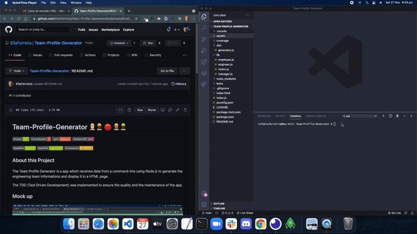

# Team-Profile-Generator 👷🏻‍♂️👷🏿‍♀️ 🔴 👷🏽👷🏿‍♂️


[](https://github.com/facebook/jest)


## About this Project

The Team Profile Generator is a app which receives data from a command-line using Node js to generate the engineering team informations and display it in a HTML page.

The TDD (Test Driven Development) was implemented to ensure the quality and the maintenance of the app.

## Mock up





[Walkthrough video](https://drive.google.com/file/d/12ck2DRe1LgAPNXVq0d5nGqBYlKJaYcBo/view?usp=sharing)

## Content

- [User Story](#user-story)
- [Acceptance Criteria](#acceptance-criteria)
- [Technologies](#technologies)
- [Installation](#installation)
- [Test Instructions](#test-instructions)
- [Sources](#sources)
- [Project Creator](#project-creator)

## User Story

```md
AS A manager
I WANT to generate a webpage that displays my team's basic info
SO THAT I have quick access to their emails and GitHub profiles
```

## Acceptance Criteria

```md
GIVEN a command-line application that accepts user input
WHEN I am prompted for my team members and their information
THEN an HTML file is generated that displays a nicely formatted team roster based on user input
WHEN I click on an email address in the HTML
THEN my default email program opens and populates the TO field of the email with the address
WHEN I click on the GitHub username
THEN that GitHub profile opens in a new tab
WHEN I start the application
THEN I am prompted to enter the team manager’s name, employee ID, email address, and office number
WHEN I enter the team manager’s name, employee ID, email address, and office number
THEN I am presented with a menu with the option to add an engineer or an intern or to finish building my team
WHEN I select the engineer option
THEN I am prompted to enter the engineer’s name, ID, email, and GitHub username, and I am taken back to the menu
WHEN I select the intern option
THEN I am prompted to enter the intern’s name, ID, email, and school, and I am taken back to the menu
WHEN I decide to finish building my team
THEN I exit the application, and the HTML is generated
```

## Technologies

- Node/Express js - backend;
- Bulma - css library;
- Jest - testing tool;
- JavaScript;
- File System;
- Inquirer npm.

## Installation

If you want to run this locally on your machine:

- Clone to your local machine from this repo
- Open the repo in your code editor (vs code for example)
- Open with F12 the command-line
- Run npm install on the terminal to install the packages, when it's done
- Also using the command-line now run node index
- Start answering the questions, once is done you will see that a file name index.html was generated

## Test Instructions

- On the command-line run npm run test
- Then see the results printed on the same screen
- All the tests should pass to generate the profiles with success

## Sources

[Form Validation Js](https://www.w3resource.com/javascript/form/email-validation.php)
[Regex Generator](https://regex-generator.olafneumann.org/?sampleText=this.id%20&flags=i&onlyPatterns=false&matchWholeLine=false&selection=)
[Jest js](https://jestjs.io/docs/getting-started)

## Project Creator

[EllaFerreira](https://github.com/EllaFerreira)

© 2021 Team Profile Generator. All rights reserved
